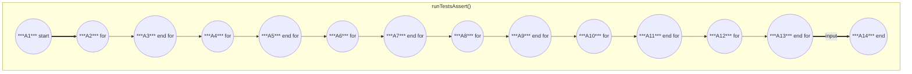
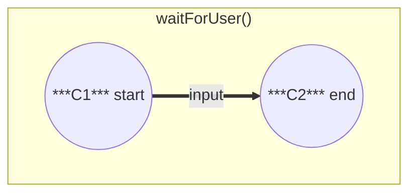
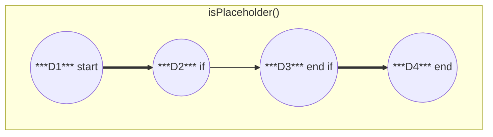
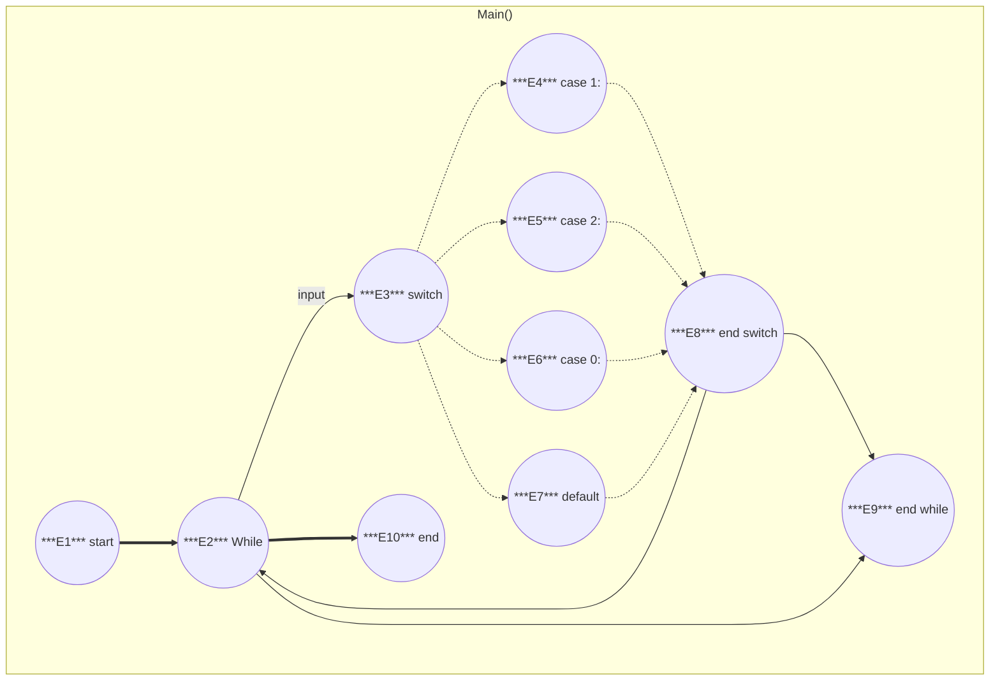
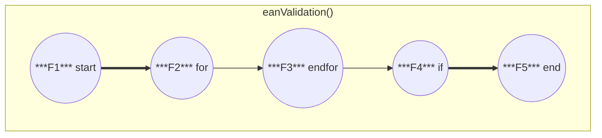
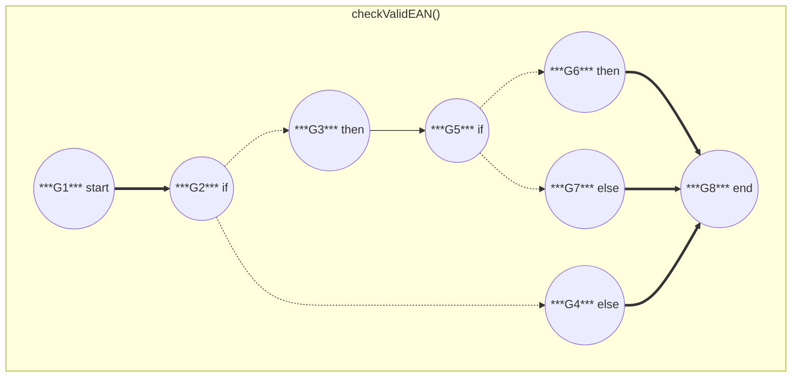
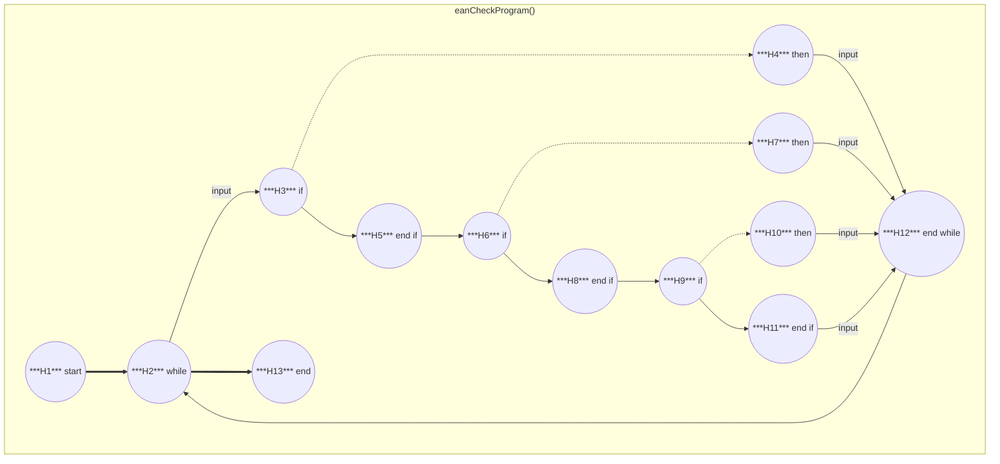

# Methods
## List of Methods in Program
 - eanCheckProgram
 - checkValidEAN
 - eanValidation
 - isPlaceholder
 - waitForUser
 - runTests
 - runTestsAssert

# Infotext for Methods
### Here is written what each Method is doing

## eanCheckProgram
``` md
This is the method for the eanprogramm, here is the menue placed. 
We wait for an input from the user. 
If the input is send, we check if the input is `exit`. 
If it is, we go back to the main menue. 
If the input is something else, we use the `checkValidEAN` method. 
After that, we use `eanValidation`. 
In the end we have a `Valid` or `Invalid` output. 
```

## checkValidEAN
``` md
We work twith the input from the user.
The input is checked via Regex if it is a digit [0-9].
Next we check the lengthof the input String, is it 8 or 13 digits long. 
If that is correct we use `isPlaceholder`.
If there are more or less digits or other symbols in the string, we give the User an response with an `invalid` text.
```

## eanValidation
``` md
Here we check if the EAN is valid or invalid:

 - Multiply the digits (excluding the check digit) alternately by 1 and 3.
 - Add up the results.
 - Calculate the remainder of the sum when divided by 10.
 - The check digit is the number needed to reach the next multiple of 10.
```

## isPlaceholder
``` md
We check with a regex if the input is a string with 8 or 13 zeros.
```

## waitForUser
``` md
This method is for clearing the screen after the end of an iteration of the process.
```

## runTests
``` md
This method is provided with some data for testing.
there are strings of type `valid`, `invalid` and `placeholder`.
They run through the functions.
```

## runTestsAssert
``` md
Here we run through the the tests again and assert the result.
```

# Walkthrough
### What will the program do?
``` md
First we start the application. We are now in the mainMenue, 
where we have 3 options: `1: runTests`, `2: EanCheck Program` and `0: End Program`.

1. If we choose 1, we will run through the tests and check the program does what it should. 
To verify the integrety of the functions. 
The results will be displayed. We get a message, that we shoult press any key. 
If we do that, we get back to the mainmenue.

2. If we choose 2, we get in the menue of the eanChecker programm. Here are 2 options: 
`exit` and `every other string`.
If we type `exit`, we will be lead back to the last screen, the mainMenue. 
If we input a string, the program will check the strings validation. 
First, it checks it the string is just providing digits and has a length of 8 or 13. 
There is also a check for placeholders like `00000000` or `0000000000000`. 
If the string is now invalid, we get a response which provide us with this data. 
The program will also restart after an input. 
If the check is still valid, now we check the ean of it`s validation. 
If it is valid, we get a response in the console `valid EAN`. 
Else we get a respone `invalid string`. 
After we pressed a key, we get back to the eanmenue and can input the next ean for the check.
```

# Control flow graphs

### runTestsAssert()


### runTests()

```mermaid
graph TD
subgraph "runTests()"
A((***B1*** start)) ==> B((***B2*** for))
B --> C((***B3*** if))
C --> D((***B4*** endif))
D --> E((***B5*** end for))
E --> F((***B6*** for))
F --> G((***B7*** if))
G --> H((***B8*** endif))
H --> I((***B9*** end for))
I --> J((***B10*** for))
J --> K((***B11*** if))
K --> L((***B12*** end if))
L --> M((***B13*** end for))
M --> N((***B14*** for))
N --> O((***B15*** if))
O --> P((***B16*** endif))
P --> Q((***B17*** end for))
Q --> R((***B18*** for))
R --> S((***B19*** if))
S --> T((***B20*** end if))
T --> U((***B21*** endfor))
U --> V((***B22*** for))
V --> W((***B23*** if))
W --> X((***B24*** endif))
X --> Y((***B25*** end for))
Y ==> Z((***B26*** end))
end
```


### waitForUser()


### isPlatceholder()


### Main()


### eanValidation()


### checkValidEAN()


### eanCheckProgram()


# Possible Ways
```markdown
**Legend**:
(<Step>)    = one step
-> next     = going to the next step 
...         = repeating process

	1. (E1) -> (E2) -> (E3) -> (E6) -> (E2) -> (E9) -> (E10)
  Explanation: `Start program` [mainmenue] -> input `0` in mainmenue -> `end programm`
 
	2. (E1) -> (E2) -> (E3) -> (E7) -> (E8) -> (E2) -> …
  Explanation: `Start program` [mainmenue] -> incorrect input -> repeat loop -> input

	3. (E1) -> (E2) -> (E3) -> (E4) -> (B1) -> (B2) -> … -> (B26) -> (A1) -> (A2) -> … -> (A14) -> (E8) -> (E2) -> …
  Explanation: `Start program` [mainmenue] -> case 1 -> `runTests` & `runTestsAssert` -> repeat loop input 

	4. (E1) -> (E2) -> (E3) -> (E5) -> (H1) -> (H2) -> (H3) -> (H4) -> (C1) -> (C2) -> (H12) -> (H13) -> (E8) -> (E2) -> …
  Explanation: `Start program` [mainmenue] -> case 2 -> `start eanCheckProgram` -> input `exit` -> `end eanCheckProgram` -> [mainmenue] -> repeat loop

	5. (E1) -> (E2) -> (E3) -> (E5) -> (H1) -> (H2) -> (H3) -> (H5) -> (H6) -> (G1) -> (G2) -> (G4) -> (G8) -> (H7) -> (C1) -> (C2) -> (H12) -> (H2) -> …
  Explanation: `Start program` [mainmenue] -> case 2 -> `start eanCheckProgram` -> input invalidString  -> check string -> reponse `invalidEan` -> repeat loop `start eanCheckProgram`

	6.  (E1) -> (E2) -> (E3) -> (E5) -> (H1) -> (H2) -> (H3) -> (H5) -> (H6) -> (G1) -> (G2) -> (G3) -> (G5) -> (G6) -> (D1) -> (D2) -> (D3) -> (D4) -> (G8) -> (H7) -> (C1) -> (C2) -> (H12) -> (H2) -> …
  Explanation: `Start program` [mainmenue] -> case 2 -> `start eanCheckProgram` -> input invalidString  -> check string -> reponse `invalidEan` -> repeat loop `start eanCheckProgram`

	7.  (E1) -> (E2) -> (E3) -> (E5) -> (H1) -> (H2) -> (H3) -> (H5) -> (H6) -> (G1) -> (G2) -> (G3) -> (G5) -> (D1) -> (D2) -> (D3) -> (D4) -> (G7) -> (G8) -> (H7) -> (C1) -> (C2) -> (H12) -> (H2) -> …
  Explanation: `Start program` [mainmenue] -> case 2 -> `start eanCheckProgram` -> input invalidString  -> check string -> reponse `invalidEan` -> repeat loop `start eanCheckProgram`

	8. (E1) -> (E2) -> (E3) -> (E5) -> (H1) -> (H2) -> (H3) -> (H5) -> (H6) -> (H8) -> (H9) -> (H10) -> (C1) -> (C2) -> (H12) -> (H2) -> …
  Explanation: `Start program` [mainmenue] -> case 2 -> `start eanCheckProgram` -> input validString but invalidEan -> response `ean invalid` -> repeat loop `start eanCheckProgram`

	9. (E1) -> (E2) -> (E3) -> (E5) -> (H1) -> (H2) -> (H3) -> (H5) -> (H6) -> (H8) -> (H9) -> (H11) -> (H12) -> (H2) -> …
  Explanation: `Start program` [mainmenue] -> case 2 -> `start eanCheckProgram` -> input validString & validEan -> respone `ean valid` -> repeat loop `start eanCheckProgram`


```

